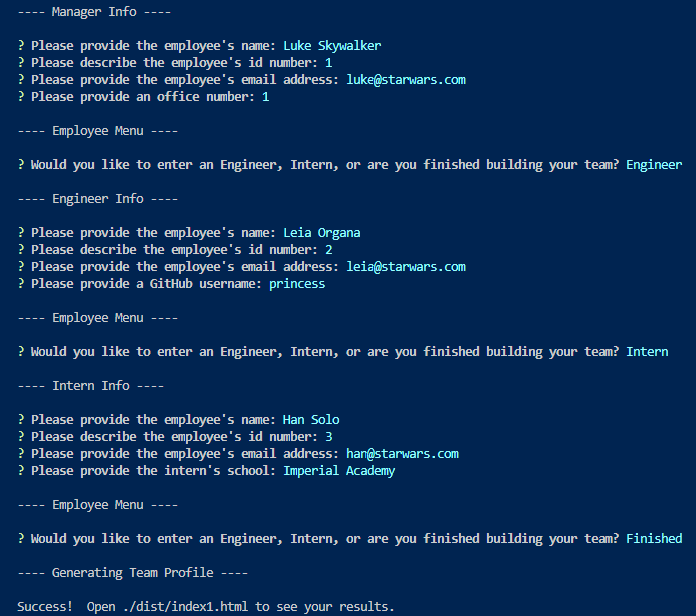
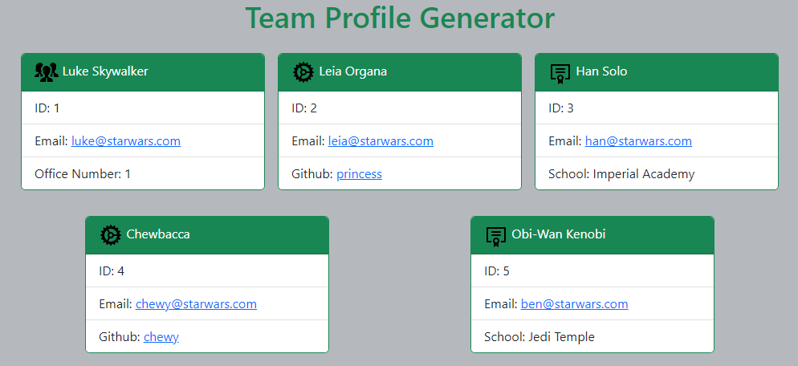

# Team Profile Generator

## Description

It's important for managers to have their employee's contact info quickly available. This is a command line application that takes in information about employees on a software engineering team, then generates an HTML webpage that displays summaries for each person.

This [Node.js](https://nodejs.org/en/) command-line application will generate an HTML file which uses [Bootstrap v5.2](https://getbootstrap.com/) for styling.

This application dynamically generates a team profile HTML file from a user's input using the [Inquirer package](https://www.npmjs.com/package/inquirer/v/8.2.4). Unit tests were developed using [Jest](https://jestjs.io/).

### User Story

```md
AS A manager
I WANT to generate a webpage that displays my team's basic info
SO THAT I have quick access to their emails and GitHub profiles
```

### Acceptance Criteria

```md
GIVEN a command-line application that accepts user input
WHEN I am prompted for my team members and their information
THEN an HTML file is generated that displays a nicely formatted team roster based on user input
WHEN I click on an email address in the HTML
THEN my default email program opens and populates the TO field of the email with the address
WHEN I click on the GitHub username
THEN that GitHub profile opens in a new tab
WHEN I start the application
THEN I am prompted to enter the team manager’s name, employee ID, email address, and office number
WHEN I enter the team manager’s name, employee ID, email address, and office number
THEN I am presented with a menu with the option to add an engineer or an intern or to finish building my team
WHEN I select the engineer option
THEN I am prompted to enter the engineer’s name, ID, email, and GitHub username, and I am taken back to the menu
WHEN I select the intern option
THEN I am prompted to enter the intern’s name, ID, email, and school, and I am taken back to the menu
WHEN I decide to finish building my team
THEN I exit the application, and the HTML is generated
```

## Table of Contents

- [Installation](#installation)
- [Usage](#usage)
- [Contributing](#contributing)
- [Tests](#tests)
- [Questions](#questions)

## Installation

After downloading the score code, run the following commands from the home directory.

```bash
npm init -y
npm install inquirer@8.2.4
npm install --save-dev jest
```

## Usage

The application will be invoked by using the following command:

```bash
npm start
```

If you invoke the application with following command, it will build the team profile with test data:

```bash
npm start test
```

Note "npm start" can be replaced with "node index.js" and the application will execute the same.

### Screenshots





## Contributing

As this project is part of an individual assignment for the University of Denver's Coding Bootcamp, it would be inappropriate for anyone else to contribute to this project.

## Tests

A total of 20 unit tests are located in the following files:

```md
./test/Employee.test.js
./test/Engineer.test.js
./test/Intern.test.js
./test/Manager.test.js
```

The tests will be invoked via Jest with the following command:

```bash
npm test
```

## Questions

GitHub Link: [https://github.com/dpk5e7](https://github.com/dpk5e7)

Please contact me at Daniel.Kelly@du.edu with any additional questions you may have.
